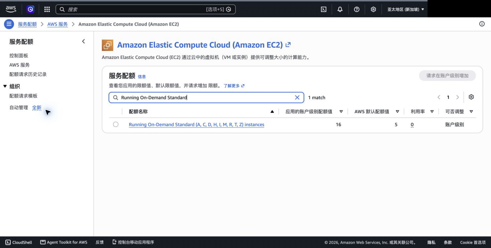

# STCN-38 — AWS staging account readiness

**Snapshot date:** 2026-10-06 (Asia/Singapore)

**Region:** `ap-southeast-1` (Singapore)

**Result:** **PARTIAL — MANUAL ACTION REQUIRED**

This report covers STCN-38 only. Account operations were stopped when the configured SSO profile could not refresh its expired session. No AWS account identifier, credentials, payment data, or secret values are recorded here.

## AWS identity

| Check | Result |
|---|---|
| Configured profiles | `course-lab`, `stcn-staging` |
| Staging profile region | `ap-southeast-1` |
| Current identity verification | **NOT VERIFIED** — `stcn-staging` SSO token expired and refresh failed on 2026-10-06; `course-lab` has no credentials |
| Required next step | `aws sso login --profile stcn-staging`, then rerun `aws sts get-caller-identity --profile stcn-staging --region ap-southeast-1` |

The next identity check must confirm the expected staging account without recording its full account ID. No AWS account-side reads or writes were run after the authentication failures.

## Free Tier credits and activities

**NOT VERIFIED.** No current credit balance, expiry date, or credit-earning activity status was available from the configured CLI session. Do not treat the architecture assumption of up to USD 200 as the account's actual balance.

Manual evidence: AWS Console → **Billing and Cost Management → Credits**. Record remaining promotional credit, expiry date, and the status of each displayed earning activity. Save a redacted screenshot at `docs/evidence/assets/STCN-38-aws-credit-status-redacted.png`; remove account identity, payment details, billing address, and unrelated personal information before saving or attaching it.

## AWS Budgets

| Alert | Result |
|---|---|
| 50% | **NOT VERIFIED** |
| 80% | **NOT VERIFIED** |
| 100% | **NOT VERIFIED** |

No Budgets API query or mutation was possible. The repository and available project configuration contain no confirmed notification address. **NOTIFICATION ADDRESS REQUIRED.** The architecture's expected total project spend is approximately USD 110–140; use a USD 140 project cost budget as the proposed ceiling, with thresholds at USD 70, USD 112, and USD 140. Verify the actual budget definition and whether an existing project budget already covers this account before creating it. Do not change the payment method or account plan.

After confirming the team notification address, inspect AWS Console → **Billing and Cost Management → Budgets**. Reuse an equivalent existing project budget if present; otherwise create a cost budget for USD 140 and add email alerts at 50%, 80%, and 100%. The credit balance check remains a separate STCN-37 cost gate.

## EC2 On-Demand Standard vCPU quota

**Historical snapshot: PASS on 2026-10-05; current value NOT RECHECKED.** The supplied read-only Service Quotas report and redacted screenshot show the applied `Running On-Demand Standard (A, C, D, H, I, M, R, T, Z) instances` quota in Singapore at 16 vCPU. The screenshot showed utilization 0 at capture time only; that is not a current capacity guarantee.

| Region | Quota name | Quota code | Current (2026-10-05) | Required | Recommended | Status |
|---|---|---|---:|---:|---:|---|
| `ap-southeast-1` | Running On-Demand Standard instances | `L-1216C47A` | 16 vCPU | 16 vCPU | 20 vCPU | Historical **PASS**; recheck required |

The required total is 3 × `t3.medium` (6 vCPU), 4 × `c6i.large` (8 vCPU), and 1 × `c6i.large` k6 host (2 vCPU). No increase request was submitted. Recheck with the AWS CLI command below after SSO login. If the applied value is below 16, request an increase to 20 using Service Quotas; otherwise the account has no additional headroom above the current plan.

```bash
aws service-quotas get-service-quota \
  --profile stcn-staging --region ap-southeast-1 \
  --service-code ec2 --quota-code L-1216C47A
```



The account identity area was masked in this evidence copy. The original unredacted screenshot remains outside the repository and must not be attached or committed.

## Domain and ACM

**DOMAIN REQUIRED FOR ACM.** The architecture specifies a team domain and allows DNS in Route 53 or the existing registrar, but the repository contains no selected domain, DNS provider, or intended staging hostname.

Use an existing team domain if available; otherwise select a Route 53 registered/hosted domain only after the team approves any purchase or renewal cost. Once confirmed, record `staging.<domain>` as the intended hostname. Request/validate the ACM certificate in `ap-southeast-1` with DNS validation through the chosen DNS provider. **Status: BLOCKED pending a team domain and DNS provider.** No certificate was requested or modified.

## GitHub OIDC

**AWS provider status: NOT VERIFIED** because the staging SSO session is expired. The repository/branch requirement is known from the configured Git remote: `hxj04121-lab/FoodLabelFlow-Microservices`.

Required trust design for the later STCN-39 implementation:

- OIDC issuer: `https://token.actions.githubusercontent.com`.
- Audience/client ID: `sts.amazonaws.com`.
- Restrict `sub` to `repo:hxj04121-lab/FoodLabelFlow-Microservices:environment:staging` (or a reviewed exact branch subject if GitHub Environments are not used); never use `repo:*/*`.
- Configure the GitHub `staging` environment to allow only the deployment branch/ref (recommended: protected `main`) and require the project's review protection before deployment.
- GitHub Actions permissions: `id-token: write`, `contents: read`; use `aws-actions/configure-aws-credentials` to assume the scoped role.
- The AWS OIDC provider and IAM deployment role are readiness checks here; their Terraform implementation belongs to STCN-39.

No GitHub OIDC provider or IAM role was created or changed.

## GitHub long-lived key policy

A repository scan found no code/config references to `AWS_ACCESS_KEY_ID`, `AWS_SECRET_ACCESS_KEY`, `aws-access-key-id`, or `aws-secret-access-key`. Current workflows grant repository contents read permission; no workflow grants `id-token: write` or uses `aws-actions/configure-aws-credentials` yet. This is a follow-up for the staging deployment workflow, not a reason to add credentials to current CI.

## Manual actions to close STCN-38

1. Refresh `stcn-staging` with `aws sso login --profile stcn-staging`; verify caller identity without recording the account ID, then repeat the EC2 quota query.
2. In Billing → Credits, capture the remaining balance, expiry date, and activity completion status in a redacted screenshot.
3. Supply the confirmed team notification address. Inspect existing Budgets and configure/reuse the USD 140 project budget with 50/80/100% notifications.
4. Confirm the team domain and DNS provider, then record the `staging.<domain>` hostname and ACM DNS validation plan.
5. With a refreshed profile, read-only check for the GitHub OIDC provider and confirm audience `sts.amazonaws.com`; retain only redacted evidence. If the refreshed quota is below the required 16 vCPU, request an increase to the recommended 20 vCPU. A verified quota from 16 to below 20 meets the minimum; 20 vCPU is recommended headroom, not a mandatory acceptance threshold.

## Scope

- STCN-37 budget calculation and gate were not changed or rerun.
- No STCN-39 Terraform modules were implemented.
- No STCN-40 EKS, RDS, or ALB spike was attempted.
- This task created no AWS resources and ran no `terraform apply`.
- No credentials, full account ID, or payment details were committed or printed.
